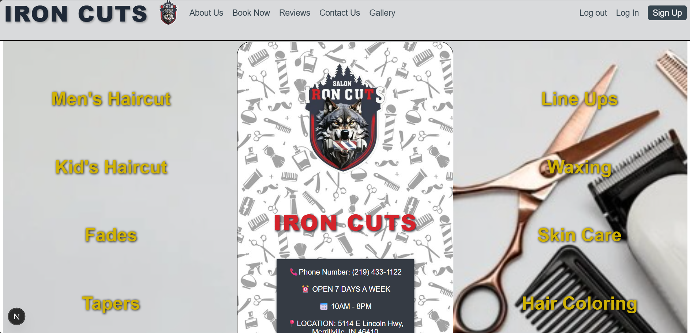
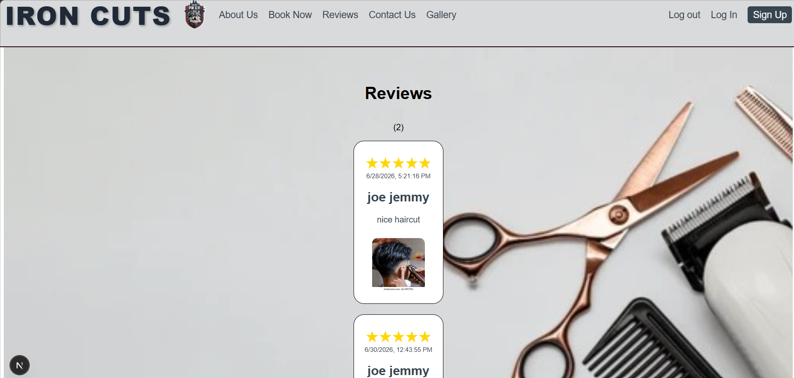
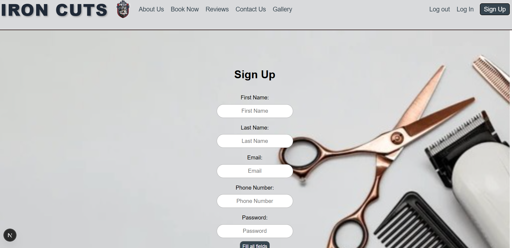
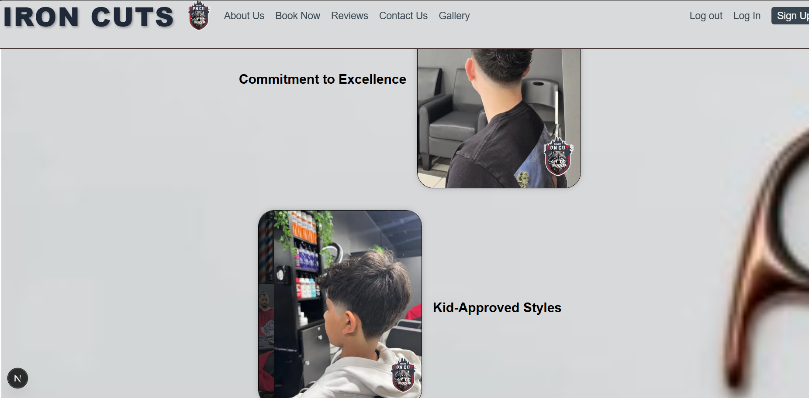

This is a Barbershop website created by NextJs framework for managing many tasks effeciently.

## Getting Started

🚀 First, run the development server:

```bash
npm run dev
# or
yarn dev
# or
pnpm dev
# or
bun dev
```

Open [http://localhost:3000](http://localhost:3000) with your browser to see the result.


## Tech Stack
Framework: Next.js
Language: JavaScript
Styling: Tailwind CSS / CSS Modules / Styled Components
Database : Mongoose with MongoDB
Frameworks : React

## Features
1. Client-side rendering (CSR) 
2. Authentication (if applicable)
3. Fully responsive design
4. API routes using Next.js backend
5. Modern UI components
6. Fast performance with optimized builds
7. Create, edit, delete tasks


## 📸 Screenshots

### Home Page


### Reviews Page


### Sign Up Page


### Gallery Page

## 📦 Installation / Setup


## Installation/ Setup

```bash
git clone https://github.com/your-username/project.git
cd project
npm install
npm run dev


🔐 Environment Variables
Create a .env.local file and add:

DB_URI=your_mongodb_connection_string
TOKEN_SECRET=your_secret_key_here
DOMAIN=http://localhost:3000

📖 How to Use / Demo

 1. When you navigate to the website you will be landing at the home page, that contains some information about the barbershop.
 2. In the navigation bar, click book now. This will take you to a list of services page. After selecting the service, press on Proceed button to be redirected to barbers page.
 3. On the next page, choose an available barber. You will then be redirected to a page showing the selected barber’s available time slots.
 4. Choose the time slot and press Book now button. This button must redirect you to the sign-in page because the website needs your credentials to proceed.
 5. ⚠️ Payment method is not implemented yet.
 6. The admin role can manage user roles, changing them between barber or keeping them as customer.
 7. Each role has its own dasboard with different permissions and features.


This project uses [`next/font`](https://nextjs.org/docs/app/building-your-application/optimizing/fonts) to automatically optimize and load [Geist](https://vercel.com/font), a new font family for Vercel.

## Learn More


You can check out [the Next.js GitHub repository](https://github.com/vercel/next.js) - your feedback and contributions are welcome!

## Deploy on Vercel

The easiest way to deploy your Next.js app is to use the [Vercel Platform](https://vercel.com/new?utm_medium=default-template&filter=next.js&utm_source=create-next-app&utm_campaign=create-next-app-readme) from the creators of Next.js.

Check out our [Next.js deployment documentation](https://nextjs.org/docs/app/building-your-application/deploying) for more details.
